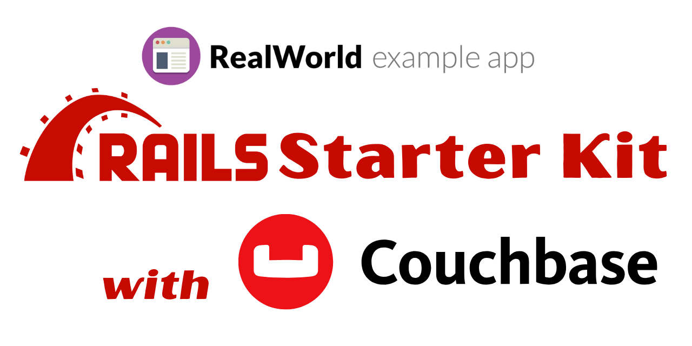

# 


[](/LICENSE)


> ### Conduit Starter Kit for Ruby on Rails

## What is Conduit?

See how the *exact* same Medium.com clone (called Conduit) is built using any of our supported frontends and backends. Yes, you can mix and match them, because they all adhere to the same [API spec](https://realworld-docs.netlify.app/docs/specs/backend-specs/introduction). 😮😎

While most "todo" demos provide an excellent cursory glance at a framework's capabilities, they typically don't convey the knowledge & perspective required to actually build _real_ applications with it.

**Conduit** solves this by allowing you to choose any frontend (React, Angular, & more) and any backend (Node, Django, & more) and see how they power a real-world, beautifully designed full-stack app called [**Conduit**](https://conduit.realworld.how).

This starter kit has everything you need to get started with Conduit using Ruby on Rails and Couchbase. It includes:

- A preconfigured Couchbase connection, all you need to do is provide your credentials.
- The beginning of an RSpec test suite to ensure your application is working as expected.

### [Demo](https://demo.realworld.io/)&nbsp;&nbsp;&nbsp;&nbsp;[Conduit](https://github.com/gothinkster/realworld)

### Getting started

Follow these steps to get the Conduit Ruby on Rails starter kit up and running on your local machine.

**Prerequisites**

Make sure you have the following installed:

* Ruby 3.3.x
* Bundler
* Rails 7.0.x
* Git

You will also need an account on Couchbase Capella to create a cluster and obtain the connection details.

**Clone the repository**

```bash
git clone https://github.com/couchbase-conduit-workshop/rails-starter-kit.git
cd rails-starter-kit
```

**Install dependencies**

```bash
bundle install
```

**Configure Couchbase Credentials**

Copy the `.env.sample` file in the root directory of the project and rename it to `.env`. Update the `.env` file with your Couchbase credentials as follows:

```bash
COUCHBASE_USER=your_COUCHBASE_USER
COUCHBASE_PASSWORD=your_couchbase_password
COUCHBASE_CONNECTION_STRING=your_couchbase_connection_string_url
COUCHBASE_BUCKET=your_couchbase_bucket
```

You can obtain those credentials by first creating an account on Couchbase Capella at [https://cloud.couchbase.com/](https://cloud.couchbase.com/) and then creating a database called `Conduit_Rails_App`. Inside the database, create a bucket. The name of the bucket is what you should use for the `COUCHBASE_BUCKET` environment variable.

Once you have done so, you can navigate to the `Connect` tab in the database and copy the connection string URL. This is what you should use for the `COUCHBASE_CONNECTION_STRING` environment variable. You will also need to create a user with the appropriate permissions and use the username and password for the `COUCHBASE_USER` and `COUCHBASE_PASSWORD` environment variables.

**Running the Test Suite**

This application includes the beginnings of a test suite using RSpec. To run the test suite, use the following command:

```bash
bundle exec rspec
```

This will run all the tests and output the results in the terminal. You can run any specific test file by passing the file path as an argument to the `rspec` command, as follows:

```bash
bundle exec rspec spec/config/couchbase_spec.rb
```

**Starting the Application**

To start the application, run the following command:

```bash
bundle exec rails server
```

This will start the Rails server, and you can access the application at [http://localhost:3000](http://localhost:3000).

### Contributing

Contributions are more than welcome! If you encounter any bugs or issues with the application, please open an issue on the GitHub repository. If you would like to contribute code, feel free to open a pull request with your changes. All contributors are expected to follow the [Code of Conduct](CODE_OF_CONDUCT.md).

### License

This project is licensed under the MIT License - see the [LICENSE](LICENSE) file for details.